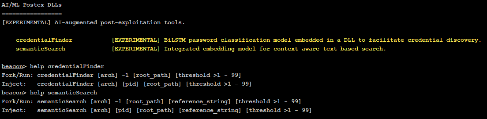

## **AI-Postex**  
Proof-of-concept on-target AI/ML post-exploitation capabilities deployed from reflectively loaded DLLs with seemless integration into Cobalt Strike. This work was presented at [BlackHat Arsenal 2025](https://www.blackhat.com/us-25/arsenal/schedule/#next-generation-post-exploitation-in-cobalt-strike-45376).

## Overview

This repository presents a prototype implementation of **AI-augmented post-exploitation capabilities**. These examples explore how artificial intelligence (AI) and machine learning (ML) can streamline and enhance traditionally manual post-exploitation tasks in offensive cybersecurity operations. The project integrates with **Cobalt Strike**, augmenting **credential harvesting** and **semantic data triage** post-exploitation workflows.

Due to licensing constraints of **Cobalt Strike's Arsenal Kit**, only partial source code is made available. This repository includes binary modules and example usage for testing and demonstration purposes.

## Contents

- `dist/` – Contains compiled binary DLLs for demonstration:
  - `credentialFinder.dll` – Locates credentials and sensitive data across filesystem or memory dumps.
  - `semanticSearcher.dll` – Performs semantic analysis on file contents or directory structures to identify high-value data.

> ⚠️ Source code is **partially omitted** due to licensing restrictions with the Cobalt Strike Arsenal Kit.

## Usage

**Prior to use of these DLLs, configure `set tasks_max_size "32097152";` or a greater size in your Malleable profile.**

`ai-postex.cna` integrates two commands, usage statements, and one help menu group directly into Cobalt Strike's Beacon console.


### credentialFinder.dll
`Usage: credentialFinder [arch] [pid] [root_path] [threshold]`
- **Purpose**: Searches for common credential patterns (e.g., cleartext secrets/passwords).
- **Args**:
    - `[root_path]` – Path to directory or file to search
    - `[threshold]` - Threshold classification confidence

---
### semanticSearcher.dll
`Usage: semanticSearch [arch] [pid] [root_path] [reference_string] [threshold]`

- **Purpose**: Performs AI-based semantic search to locate sensitive or high-value information using natural language understanding.
- **Args**:
  - `[root_path]` – Path to directory or file to search
  - `[reference_string]` - Reference string as search argument
  - `[threshold]` - Contextual similarity threshold

## Research Goals

- Reduce cognitive and operational load on red team operators during post-exploitation.
- Demonstrate feasibility of AI models in relevant post-ex contexts.
- Illuminate novel attack techniques for defenders to anticipate and harden against.
- Promote responsible disclosure and awareness of emerging offensive techniques.

## Limitations

- `semanticSearch.dll` and `credentialFinder.dll` have only been tested on `Windows 11, version 2104` or newer.
- Source code disclosure is limited to respect Cobalt Strike licensing agreements.
- DLLs are intended for academic and research purposes only.
- High CPU usage by these DLLs is a distinctive characteristic. `process_stats/` contains some relevant performance statistics captured during internal testing.

## Acknowledgements
- Will Schroeder's work on BiLSTM architectures for credential classification. 
  - https://github.com/GhostPack/DeepPass
- Matt Ehrnschwender's work on embedding large files into C++ programs.
  - https://blog.cybershenanigans.space/posts/embedding-files-in-c-cpp-programs/
- Xiao et al. (2023) for their work on `bge-base-en-v1.5`
  - https://huggingface.co/BAAI/bge-base-en-v1.5 

## Academic Disclosure
- This work is based on work conducted during my Master's program at the Georgia Institute of Technology.

## Citation

If referencing this research in academic or technical works, please cite as:

```bibtex
@misc{ai-postex,
  author = {0xtriboulet},
  title = {Next-Generation Post-Exploitation in Cobalt Strike},
  year = {2025},
  note = {Available at url {https://github.com/cobalt-strike/ai-postex}}
}
```